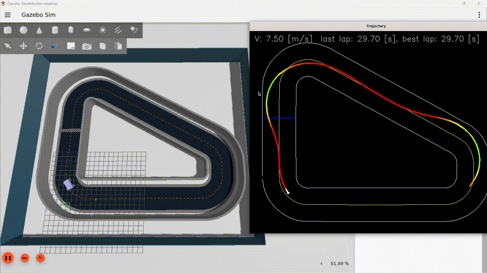
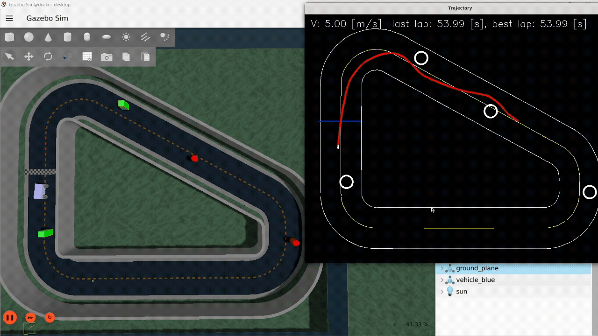
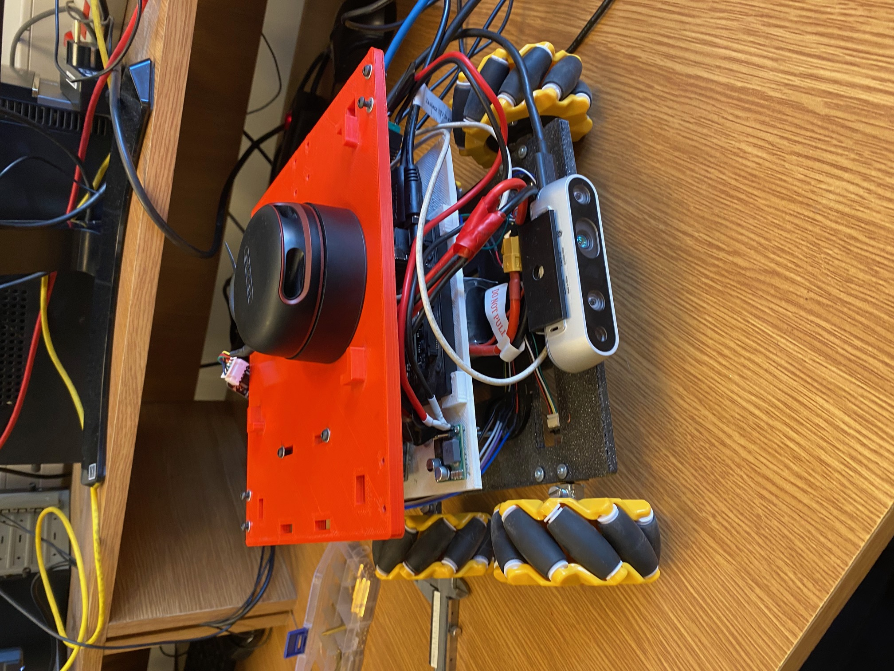

# Reinforcment learning - autonomous mecanum car 

## **Project Overview**

This project implements an end-to-end Reinforcement Learning (RL) pipeline for an autonomous car equipped with Mecanum wheels. The agent is trained in a simulated Gazebo environment to follow roads at high speeds while avoiding obstacles, using a fused sensor input (Lidar + RGB Camera). The system is designed with a "Sim-to-Real" approach, allowing deployment on physical hardware via NVIDIA Jetson Xavier.

## **Project roadmap**
- [x] Model training in simulation (Reinforcement Learning)
- [x] Model inference in simulation
- [/] Hardware deployment & system adaptation
  > **Current Status:** Codebase is complete. Currently undergoing hardware integration tests; facing some blockers regarding code compatibility with specific Jetson architecture.
  
___
## System Architecture

**Neural Network Model**

The core logic resides in: <br>
`RL_Autonomous_Car\siapwpa_ros2_project-main_rl\autonomous_vehicles\autonomous_vehicles\net_agent\net_v1.py`. 

Model was implemented in PyTorch.

**Inputs**:
- Lidar Data: 1D Laser scan arrays for proximity detection.
- Visual Data: RGB frames for road following and lane detection.

**Output:**
- Continuous actions for longitudinal speed, and angular velocity along vertical axis. 

Model was trained using **PPO** algorythm implemented in [**stable-baseline-3**](https://stable-baselines3.readthedocs.io/en/master/). 

- Car with mecanum wheels, sensors and simulation envirnment is configure in: <br>
`RL_Autonomous_Car\siapwpa_ros2_project-main_rl\models\walls\mecanum.sdf`

- Environment to reinforcement learing is implemented in: <br>
`RL_Autonomous_Car\siapwpa_ros2_project-main_rl\autonomous_vehicles\autonomous_vehicles\training\gazebo_car_env.py`

- Training script with traning details: <br>
`RL_Autonomous_Car\siapwpa_ros2_project-main_rl\autonomous_vehicles\autonomous_vehicles\training\training_SB3.py`

Model purpose was to **follow the road**, **maximizie speed** and **avoid collision**.


## **Python dependencies**
| Package | Version |
| :--- | :--- |
| **stable_baselines3** | 2.7.1 |
| **gymnasium** | 1.2.2 |
| **torch** | 2.9.1 |
| **torchvision** | 0.24.1 |
| **segmentation_models_pytorch** | 0.5.0 |
| **numpy** | 1.24.4 |


___
## **Results**

**Visualisation**

**Maximizing speed**
___
<br>

<br><br><br>

**Avoiding obstacles**
___
<br>

<br>
Note: Colour of line drawed by car is heatmap of speed gradient in order to better representation of working. 


### How to run inference:

Open folder `siapwpa_ros2_project-main_rl/` in docker container 

Perform following commands:

```bash
colcon build --packages-select autonomous_vehicles

source install/setup.bash`

ros2 launch autonomous_vehicles sim_inference.auto.launch.py`
```

### How to run training:

Open folder `siapwpa_ros2_project-main_rl/` in docker container 

Perform following commands:

```bash
colcon build --packages-select autonomous_vehicles

source install/setup.bash

ros2 launch autonomous_vehicles RL.auto.launch.py
```
___

## **Hardware Deployment (Sim-to-Real)** [in development]
Next step is to adapt system to transition from simulation to a physical environment. 



### **Hardware Specification**:
Compute: [**NVIDIA Jetson Xavier NX 2**](https://www.nvidia.com/en-us/autonomous-machines/embedded-systems/jetson-xavier-nx/) 

Sensors: 
- **2D lidar** [Slamtec A2M8](https://bucket-download.slamtec.com/20b2e974dd7c381e46c78db374772e31ea74370d/LD208_SLAMTEC_rplidar_datasheet_A2M8_v2.6_en.pdf)
- **RGB Camera** [Realsens D435i](https://www.realsenseai.com/products/depth-camera-d435i/)

ROS environment: [**ROS2 Foxy**](https://docs.ros.org/en/foxy/index.html).

Software Integration
The hardware-specific implementation, including ROS2 nodes sensor bridges and communication with motor controllers, is located in: 

`RL_Autonomous_Car/siapwpa_ros2_project-main_rl/real_car_controller`

### How to deploy control system on hardware:

To run, perform following command:

```bash
python3 real_car_controller/controller_main.py
```

## **Directory Structure**
```text
📂 autonomous_vehicles/
├── 📂 autonomous_vehicles/
    ├── 📂 training/               # Custom wrapper ([Gym](https://www.gymlibrary.dev/), [Gazebo](https://gazebosim.org/home)) & training scripts
    ├── 📂 net_agent/              # PyTorch neural network implementation
    └── 📂 car_controller/         # ROS2 nodes for simulation inference
├── 📂 net_road_segmentation/      # Encoder pre-training files
├── 📂 real_car_controller/        # ROS2 nodes for hardware deployment
├── 📂 sllidar_ros2/               # Lidar data acquisition and ROS2 nodes
└── 📂 models/                     # SDF and mesh files for the car and environment.
```
